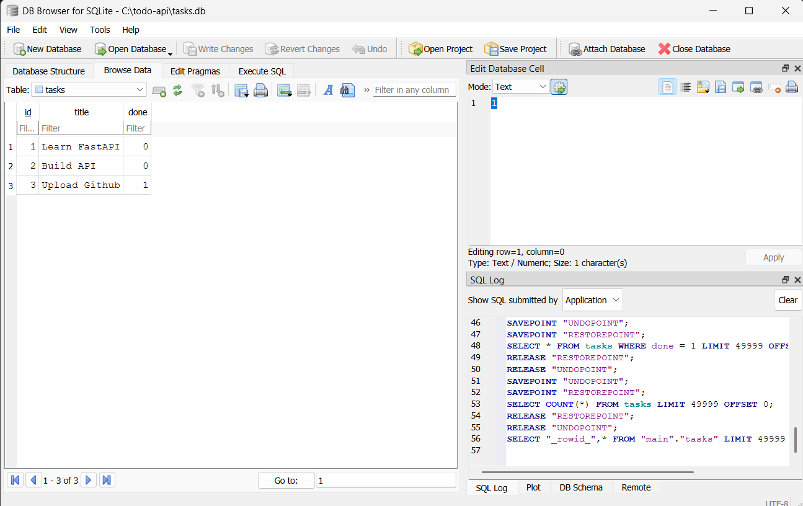

# Task API

A simple CRUD to-do API built with **FastAPI** and **SQLite**.

This version keeps the same API as the in-memory assignment, but task data now lives in a database file so it survives restarts.

## Why SQLite

SQLite was a good fit for this assignment because it is lightweight, requires no separate server, and creates a single `tasks.db` file automatically when the app starts.

## Where the database lives

The database file is stored next to `main.py` as `tasks.db`.

## How to run

```bash
python -m venv venv
venv\Scripts\activate
pip install -r requirements.txt
uvicorn main:app --reload
```

The app creates `tasks.db` and the `tasks` table automatically on first run, then inserts three sample tasks only when the table is empty. The database file is git-ignored so each fresh clone can create its own local copy.

## Example SQL

```sql
SELECT * FROM tasks WHERE done = 1;
```

This query returns only the completed tasks from the `tasks` table.

## Database viewer screenshot



The screenshot shows the `tasks` table in DB Browser for SQLite with the three seeded rows.

## API

- `GET /tasks`
- `GET /tasks/{id}`
- `POST /tasks`
- `PUT /tasks/{id}`
- `DELETE /tasks/{id}`

## AI vs me

This bonus stage compares my hand-built SQLite migration in `main.py` with an AI-generated version kept in `ai-version/`.

### Prompt used

```text
Migrate my Python FastAPI in-memory task CRUD API to SQLite.

Requirements:
- Use Python 3.10+ with FastAPI and the built-in sqlite3 module.
- Store data in a file named tasks.db next to the app.
- Create a tasks table if it does not exist with columns: id (integer primary key), title (text), done (boolean stored as 0/1).
- On startup, insert three example tasks only when the table is empty.
- Keep these endpoints with the same behaviour as before:
  - GET /tasks
  - GET /tasks/{id}
  - POST /tasks
  - PUT /tasks/{id}
  - DELETE /tasks/{id}
- POST returns 201, DELETE returns 204, invalid body returns 400, unknown id returns 404.
- Use parameterized SQL queries with ? placeholders for user input.
- Return JSON errors in the shape {"error": "..."}.
```

### What the AI did better

- The rematch in `ai-version/main_v2.py` wrapped the seed inserts in an explicit transaction, which makes the three starter rows all-or-nothing.
- The AI version used shorter helper names and kept each endpoint self-contained, which is easy to read for a small app.

### What the AI got wrong

- The first AI version in `ai-version/main.py` inserted the three seed tasks on every startup, so restarting the app multiplied the examples from 3 to 6 to 9.
- The first AI version built `GET /tasks/{id}` with an f-string (`f"SELECT * FROM tasks WHERE id = {task_id}"`) instead of a `?` placeholder, which breaks the safety rule from the assignment.
- The first AI version returned `{"error": "Task 999 not found"}` instead of the exact `{"error": "Task not found"}` message required by Assignment 1.

### What my prompt forgot to specify

- I did not say the 404 message had to stay exactly `"Task not found"`, so the AI invented a more descriptive error string.
- I did not explicitly say "count rows before seeding," so the first attempt re-seeded on every restart.
- I did not forbid f-strings in SQL, so the AI used one in the read-by-id query.

### Rematch

I reran the migration with `ai-version/prompt-v2.txt`, adding rules for seed-once behaviour, transaction-wrapped seeding, no f-string SQL, and exact error messages. The second version fixed the duplicate seed bug and the unsafe query, but it still differs from my hand-built code because it has no custom exception handler and lives in a separate `ai-version/` folder on purpose.
